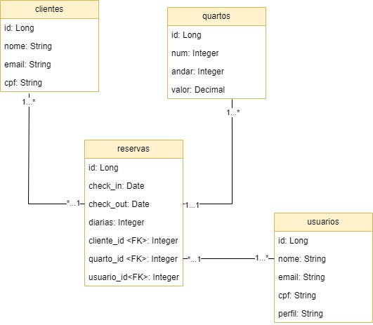

<h1 align="center">W-Hotel</h1>

<h4 align="center">
  ☕ Realize reservas de um quarto 
</h4>

## 💻 Projeto
O projeto W-Hotel é uma API simples que permite cadastrar quartos, clientes e usuários, além de realizar reservas de quartos com validações, proporcionando uma experiência eficiente.

## :rocket: Tecnologias

Tecnologias utilizadas no projeto:

- Java
- Spring Boot
- Banco de Dados Postgres
- JPA

## 👨‍💻 Endpoints
- [POST] salvar usuário
- [POST] salvar cliente
- [POST] salvar quarto
- [POST] realizar uma reserva
- [GET] buscar uma reserva
- [PUT] atualizar reserva
- [DELETE] excluir uma reserva

<strong>Endpoints disponiveis na raiz do projeto</strong>

## 🤔 Como contribuir

- Faça um fork desse repositório;
- Cria uma branch com a sua feature: `git checkout -b minha-feature`;
- Faça commit das suas alterações: `git commit -m 'feat: Minha nova feature'`;
- Faça push para a sua branch: `git push origin minha-feature`.

Depois que o merge da sua pull request for feito, você pode deletar a sua branch.

---

Desenvolvido por [William José Dias!](https://github.com/WilliamWJD)
